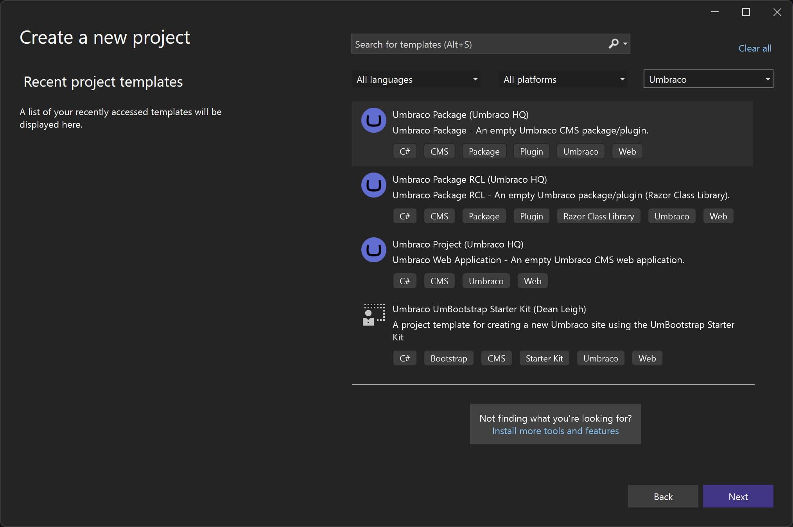

# UmBootstrap

## Description
UmBootstrap is an Umbraco Website Starter Kit using Bootstrap Templates and a comprehensive Component Library all available for you to use in your projects.

What makes UmBootstrap different from other starter kits is that it is not installed via a Nuget Package on top of an existing Umbraco website, it 'is' an Umbraco website on installation as a dotnet project template.

## Features

At the heart of UmBootstrap is an Umbraco website containing:
* Page layout templates
* Section layout templates
* Component templates

All of these are constructed using Umbraco doctypes and datatypes and Bootstrap HTML, CSS and JavaScript.

## Installation for Contributors

We welcome contributions to UmBootstrap, however [Contributing to UmBootstrap](CONTRIBUTING.md) requires a different process to installing UmBootrap using the instructions intended for users.

Please refer to the following guide for instructions on how to contribute to UmBootstrap:
- [Contributing to UmBootstrap](CONTRIBUTING.md)

> [!WARNING] 
> Pull requests will not be accepted from users who have not followed the guidelines

## Installation for Users

UmBootstrap is an Umbraco website that is installed as a dotnet project template.

There are two ways for users to install UmBootstrap:
1. Using [.NET CLI](https://learn.microsoft.com/en-us/dotnet/core/tools/)
2. Using Visual Studio

> [!IMPORTANT] 
> If you wish to use UmBootstrap for its intended purpose:
> - You should install it using the [.NET CLI](https://learn.microsoft.com/en-us/dotnet/core/tools/) or Visual Studio
> - You should not use the UmBootstrap repository

### .NET CLI

To install UmBootstrap using the .NET CLI, follow these steps:

#### 1. Install the UmBootstrap dotnet template

Open a command prompt and run the following command:

    dotnet new install Umbraco.Community.Templates.UmBootstrap

> [!NOTE]
> The syntax may differ depending on the version of .NET SDK you have installed. 
> For more information, see:
> - [dotnet new install](https://learn.microsoft.com/en-us/dotnet/core/tools/dotnet-new-install)

#### 2. Create a new UmBootstrap website

To create a new UmBootstrap instance run the following command:

    dotnet new umbootstrap -n MyWebsiteName

 This will create a new Umbraco website with UmBootstrap already installed in a folder called MyWebsiteName.

#### 3. Run the Umbraco website

To run the Umbraco website, navigate to the MyWebsite folder and run the following command:

    dotnet run

This will start the Umbraco website on http://localhost:[port number]

#### 4. Complete the Umbraco installation

To complete the Umbraco installation, open a browser and navigate to http://localhost:[port number]

This will start the Umbraco installation wizard.

> [!NOTE]
> The Umbraco installation wizard will not start until you have run the Umbraco website for the first time.

#### 5. Complete the Umbraco installation wizard

Complete the Umbraco installation wizard

 ### Visual Studio

 To install UmBootstrap using Visual Studio project templates, follow these steps:

#### 1. Create a new project

 

#### 2. Search for UmBootstrap or choose Umbraco from Project Type

#### 3. Select UmBootstrap and click Next

#### 4. Enter a project name and click Create

This will create a new Umbraco website with UmBootstrap already installed.

## Usage

UmBootstrap is designed to be used as a starter kit for building websites. It is not a theme or a package. It is a website that you can use as a starting point for your own website.

However, it is not a blank canvas. It is a fully functional website with a variety of page and section templates and a rich component library.

This is ideal if you are new to Umbraco and want to learn how to build websites using Umbraco and Bootstrap.

However, for more experienced developers, you may find that you want to remove some of the templates and components that you don't need or copy and paste the ones that you do need into your own website.
